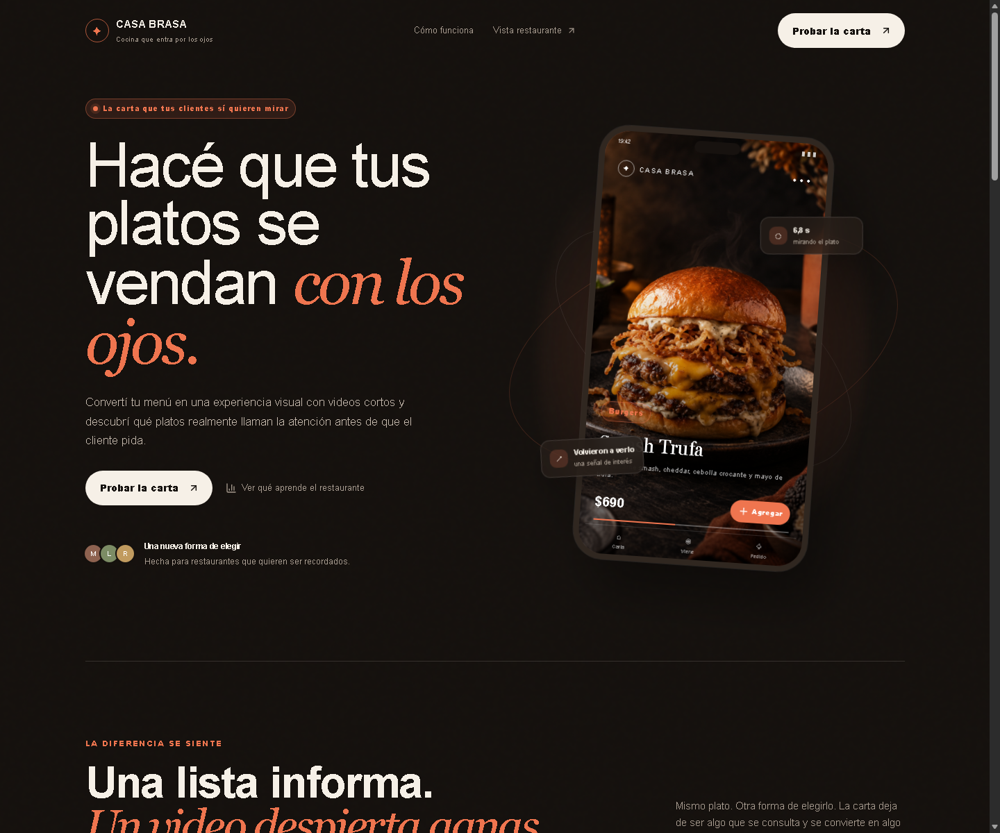
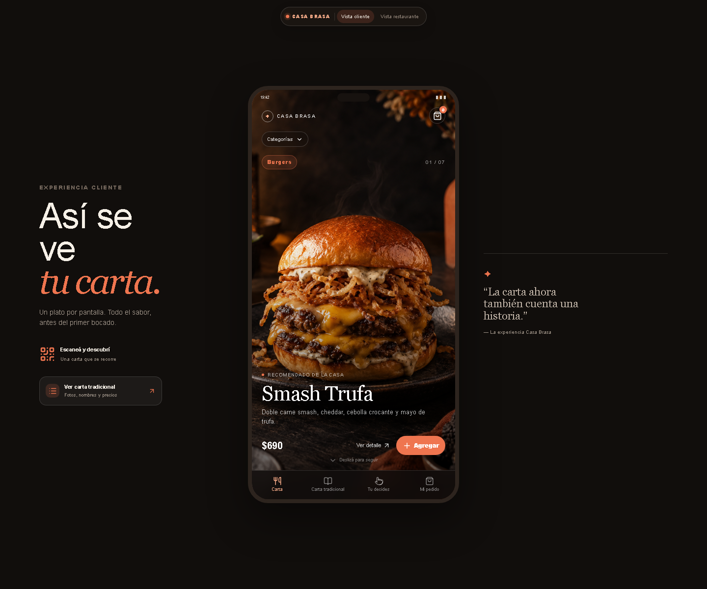
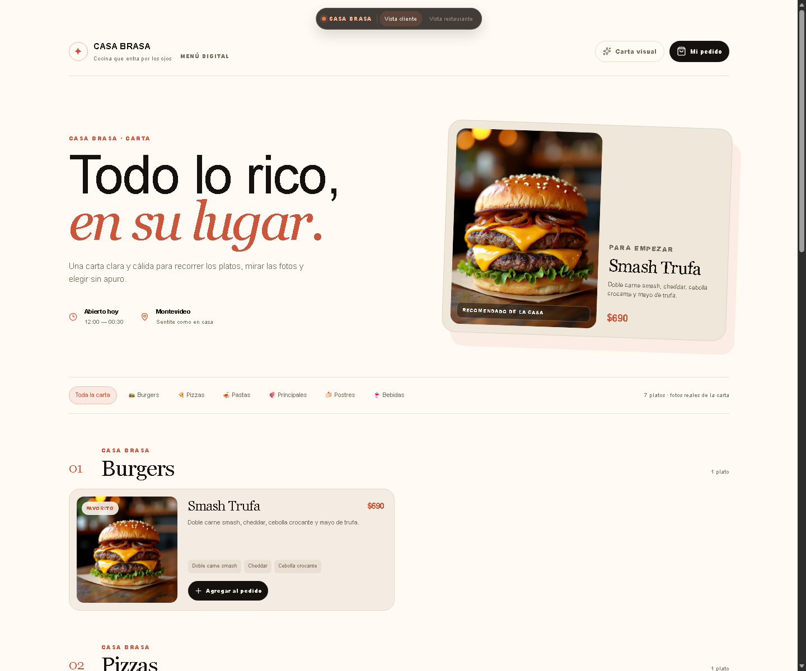
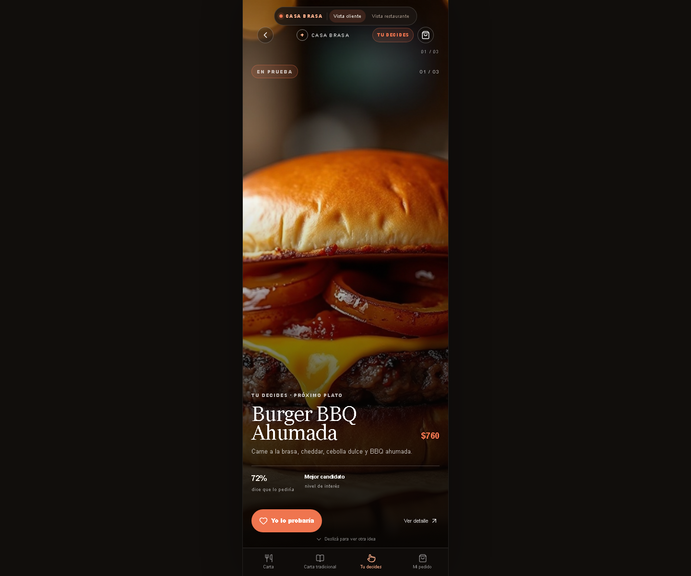
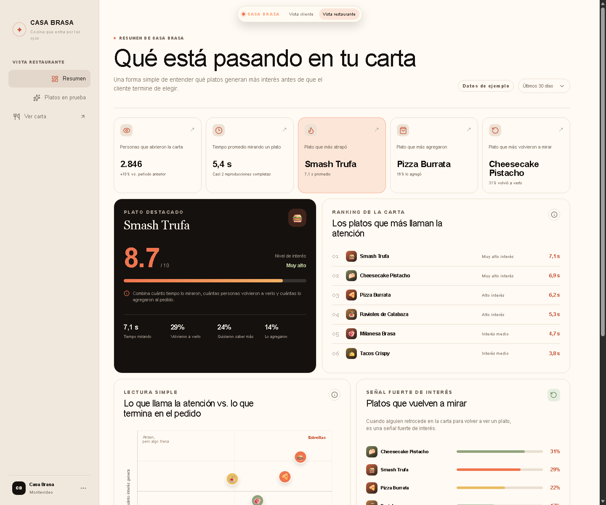
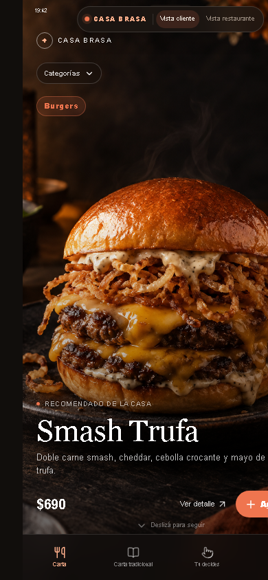
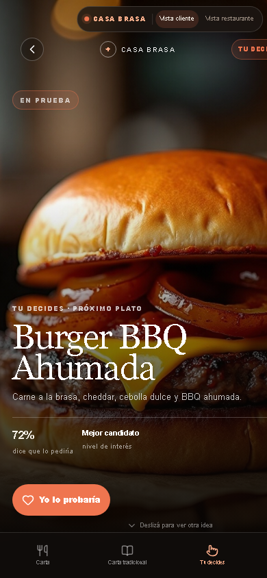

# Referencia visual de la demo

Estas capturas representan el estado de la interfaz antes de iniciar la migración funcional. Se tomaron el 21 de septiembre de 2026 desde el servidor local, en un viewport de escritorio de 1440 × 1200 px.

## Landing comercial

La pantalla presenta Casa Brasa como una propuesta de menú visual, muestra el teléfono de ejemplo, compara carta tradicional con carta en video y enlaza a las experiencias de cliente y restaurante.

## Carta visual

La carta muestra un plato por pantalla, reproduce el medio activo, ofrece categorías y mantiene el acceso al pedido.

## Carta tradicional

La alternativa tradicional organiza los platos por categorías, utiliza fotografías, muestra ingredientes y permite agregarlos al pedido.

## “Tu decides”

El feed de candidatos presenta platos futuros, porcentaje de intención de compra, estado de interés y acción de voto.

## Dashboard del restaurante

El dashboard resume métricas de atención, elección y revisita. En la demo los datos están marcados como datos de ejemplo.

## Carta visual en móvil

La carta visual conserva el formato de teléfono, la navegación inferior, el contador del pedido y el foco en un único plato en un viewport de 390 × 844 px.

## “Tu decides” en móvil

El feed de candidatos ocupa el viewport vertical y conserva la acción de voto, el acceso al detalle, el progreso y la navegación inferior.

## Observaciones de esta referencia

- En 390 px de ancho, algunos elementos del ribbon superior y el botón de agregado quedan parcialmente recortados horizontalmente. Se conserva como comportamiento de referencia del hito 1 y deberá corregirse durante la fase de endurecimiento responsive.
- La captura de la carta visual depende del primer medio disponible; si un video no carga, la interfaz debe conservar el fallback visual documentado en `demo-baseline.md`.

## Criterio de comparación

Durante la migración deben conservarse, salvo decisión explícita del producto:

- jerarquía visual y estructura de navegación;
- identidad cromática y tratamiento editorial;
- estados de carga y fallback visual de medios;
- jerarquía de información en tarjetas, detalles y dashboard;
- lectura clara en escritorio y adaptación posterior a móvil.
